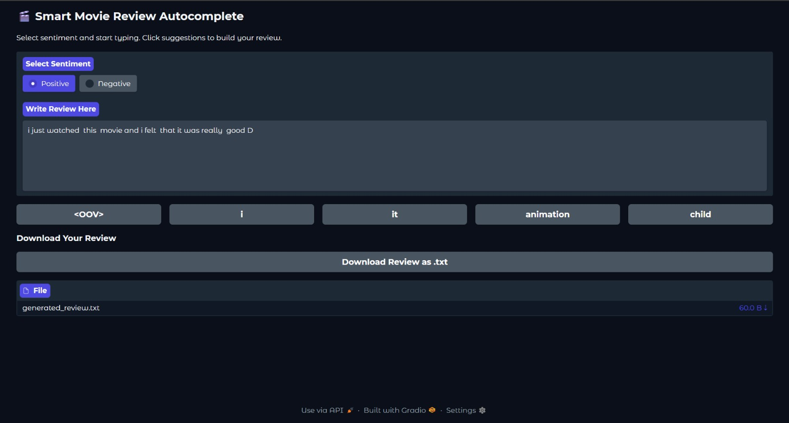

# 🎬 Smart Movie Review Autocomplete (LSTM + NLP)

---

## 📌 Overview

This project builds an LSTM-based NLP system to generate and autocomplete movie reviews based on user input and sentiment.

It allows users to interactively construct reviews with AI-powered suggestions and download the final output.

---

## 🖥️ Demo Interface



---

## 🧑‍💻 How to Use the Application

1. Select the sentiment (Positive / Negative)
2. Start typing your movie review in the input box
3. The model suggests next words based on your input
4. Click on suggestions to build your sentence
5. Continue until your review is complete
6. Download the generated review as a `.txt` file

---

## 🚀 Features

* Sentiment-based review generation (Positive / Negative)
* Real-time word suggestions
* LSTM-based sequence prediction
* Interactive UI using Gradio
* Download generated reviews as text files

---

## 🛠️ Tech Stack

* Python
* TensorFlow / Keras
* NumPy
* Pandas
* Scikit-learn
* Gradio

---

## ▶️ Run the Project

```bash
pip install -r requirements.txt
python app.py
```

---

## 📊 Dataset

IMDB Movie Reviews Dataset

---

## ⚠️ Note

This is a baseline LSTM model. Performance can be improved using advanced models like Transformers.

---

## ✨ Future Improvements

* Deploy as a web application
* Improve prediction accuracy
* Replace LSTM with Transformer-based models
* Enhance UI/UX

---

## 🙌 Author

Praneeth D
